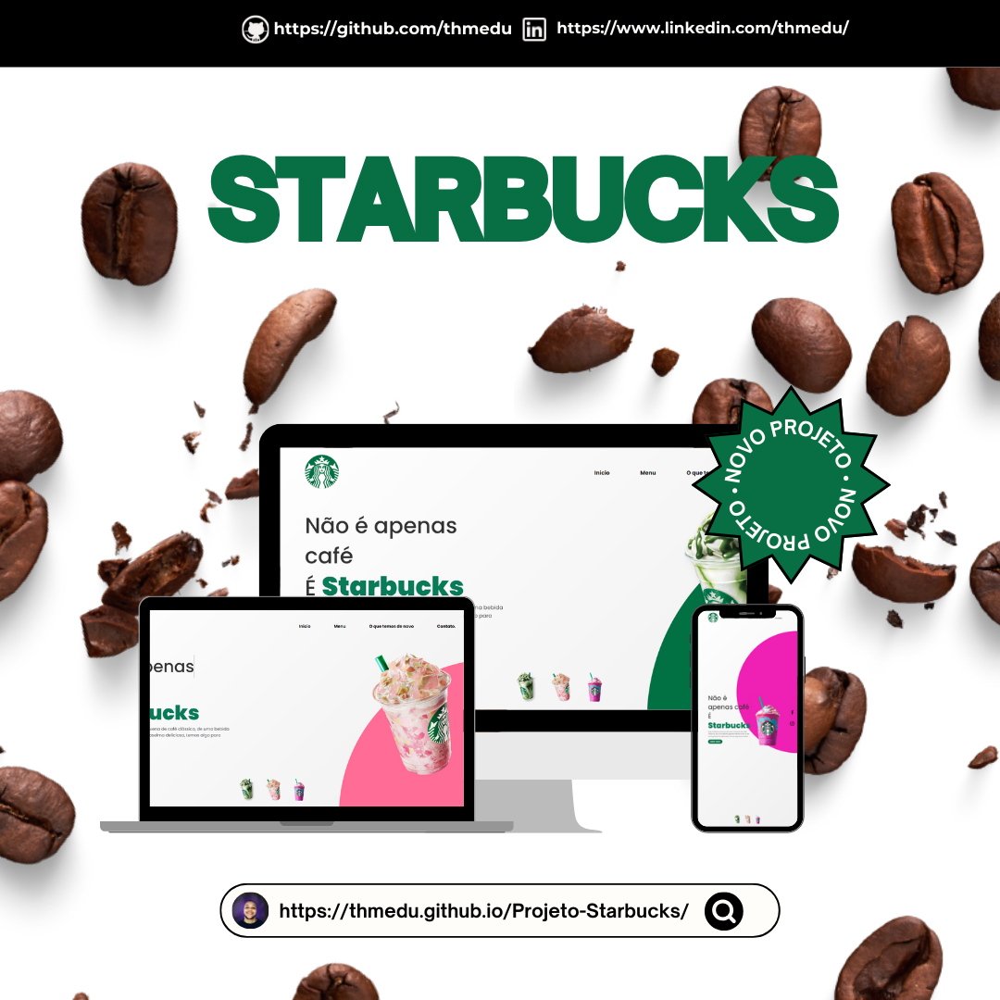

#   Olaá, Bem Vindo ao meu GitHub
Me chamo Thomas e atualmente sou desenvolvedor Web Fullstack. Você sabe por que sou Fullstack? Porque admiro muito as tecnologias utilizadas tanto no front-end quanto no back-end. Estou vindo de uma transição de carreira onde fiz uma virada completa no meu mindset e mergulhei de cabeça no mundo da tecnologia. 

##   Socials:

     

#  Tech Stack:
                                       

---
#   Projetos  

| Shortener         | GTA V                  | Pokedex                | Coca Cola              | Starbucks              | Cafeteria              |
| ------------------ | ---------------------- | ---------------------- | ---------------------- | ---------------------- | ---------------------- |
|  |  |  |  |  |  |

---

#  GitHub Stats:
 
 

###  Top Contributed Repo

<!-- Proudly created with GPRM ( https://gprm.itsvg.in ) -->
